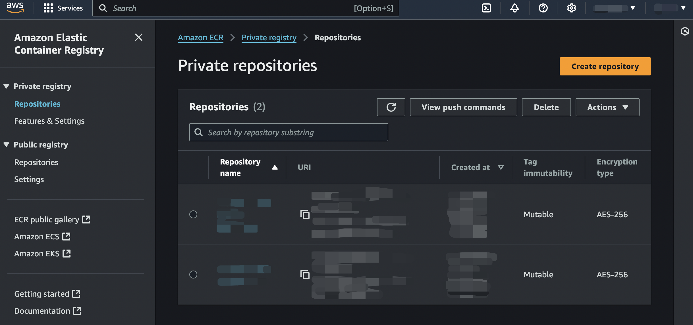
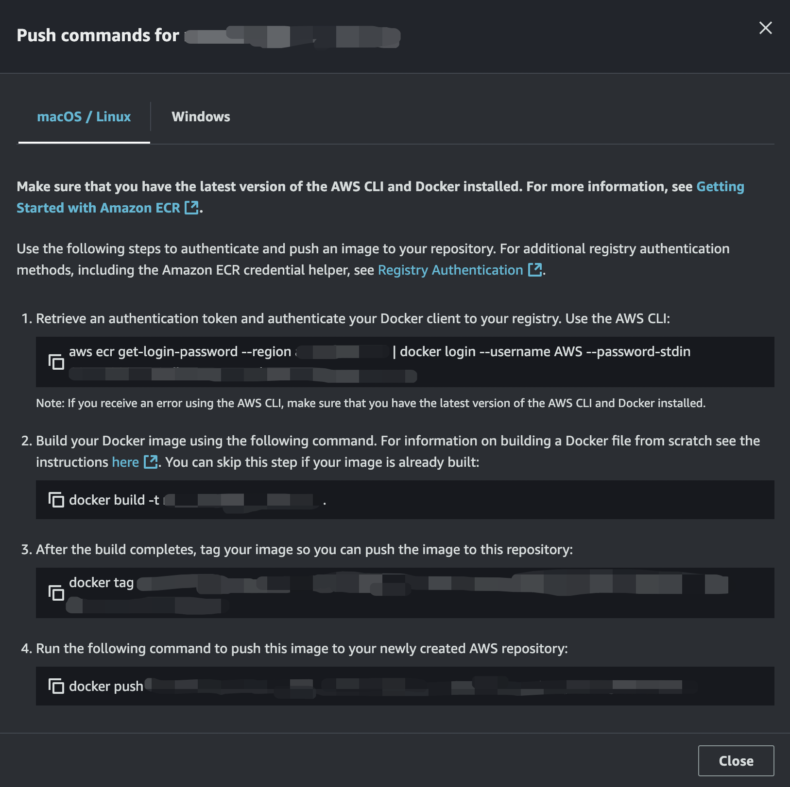
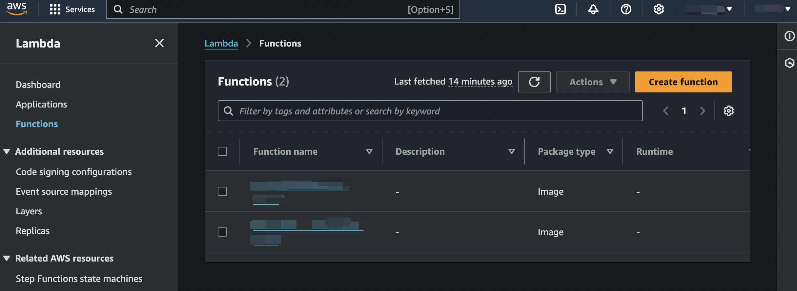
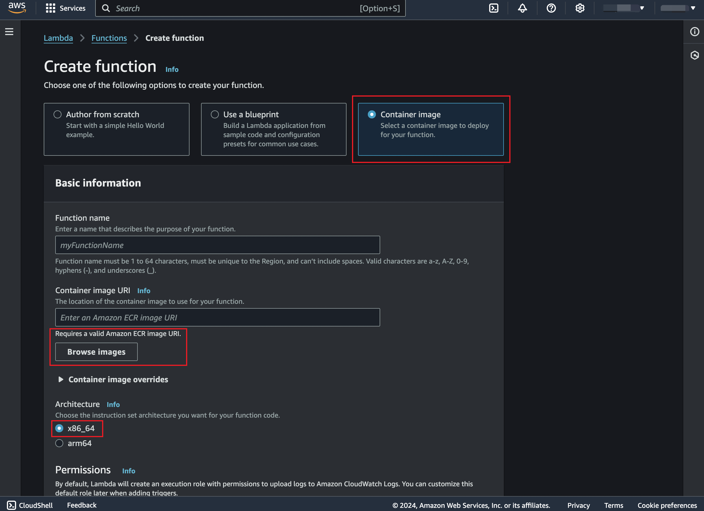
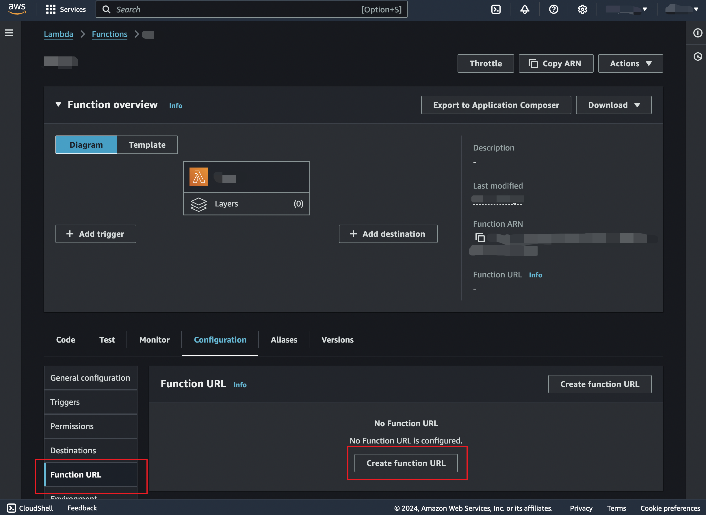
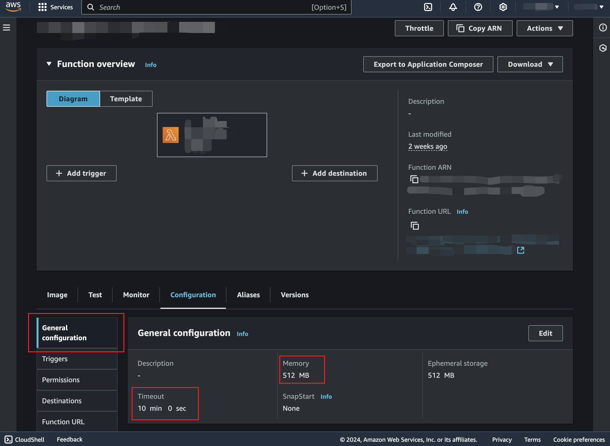

The source code is available [in my repository](https://github.com/Isaac-Fate/resnet-image-recognition).


## Start a New Project


First, create an new virtual environment:

```sh
python -m venv ~/pyvenvs/lambda
```

I used venv for creating the environment, and I named it `lambda` and placed it in the `~/pyvenvs` directory.
You may use any other environment manager and name as you wish.

I will name the project `resnet-image-recognition`:

```sh
mkdir resnet-image-recognition
cd resnet-image-recognition
```

The Python packages we are going to use are
- `awslambdaric` AWS need this package, the runtime interface client, to manage the interaction betweeen Lambda and our source code. See more details [here](https://docs.aws.amazon.com/lambda/latest/dg/python-image.html#python-image-clients). It will be used as the entry point of the container, as we will see later.
- `pydantic` My ~go-to~ only choice for defining data models.
- `fastapi[standard]` Framework for building APIs. Use `standard` feature here to install the `fastapi` CLI.
- `mangum` An adapter for running ASGI applications in AWS Lambda. It is used to wrap our FastAPI app: `Mangum(app)`.
- `torch` We use PyTorch to define the Resnet50 model.
- `torchvision` We need utilities for transforming images before feeding them into the model.

Project structure:

```
resnet-image-recognition
├── resnet_image_recognition
│   ├── __init__.py
│   ├── resnet
│   │   ├── __init__.py
│   │   └── ...
│   └── image_recognizer
│       ├── __init__.py
│       ├── image_recognizer.py
│       └── imagenet_classes.py
├── app
│   ├── __init__.py
│   ├── app.py
│   ├── auth
│   │   ├── __init__.py
│   │   └── validate_api_key.py
│   └── handlers
│       ├── __init__.py
│       ├── health_check.py
│       └── recognize_image.py
├── models
│   └── resnet50-0676ba61.pth
├── api-keys.txt
├── Dockerfile
└── .gitignore
```


## Define the Restnet50 Architecture

When I was learning the [Resnet](https://doi.org/10.48550/arXiv.1512.03385), I found the original implementation is not that easy to understand.
So, I implemented the Resnet model using PyTorch from scratch and add a lot of comments.
Hope it will help you.

I put my source code for the Resnet in the sub-package `resnet_image_recognition/resnet`.
Check it [here](https://github.com/Isaac-Fate/resnet-image-recognition/tree/main/resnet_image_recognition/resnet). 
In this project, we will be using Resnet50.

To use the model for inference,
we also need the pretrained weights (`.pt` or `.pth` files). 
You can download the one provided by PyTorch from [here](https://download.pytorch.org/models/resnet50-0676ba61.pth).

Save it under the `model` directory.


## Implement the `ImageRecognizer` using the Resnet50 Model

We are now going to create a simple `ImageRecognizer` class powered by the Resnet50 model.
It has a `recognize` method, which takes a PIL image as input and returns the class of that image.


```py
# resnet_image_recognition/image_recognizer/image_recognizer.py

from pathlib import Path
from PIL import Image as im
import torch
from torchvision import transforms
from ..resnet import ResNet50
from .imagenet_classes import IMAGENET_CLASSES


class ImageRecognizer:

    def __init__(self, model_path: Path) -> None:

        # Load the state dict
        state_dict = torch.load(model_path)

        # Create an empty model
        self._model = ResNet50()

        # Set the pretrained weights
        self._model.load_state_dict(state_dict)

        # Set evaluation mode
        self._model.eval()

    def recognize(self, image: im.Image) -> str:
        """
        Recognizes the class of an image.

        Parameters
        ----------
        image : Image
            The input image.

        Returns
        -------
        str
            The name of the class of the given image.
        """

        # Resize the image
        resized_image = transforms.Resize((224, 224))(image)

        # Convert to tensor
        image_tensor = transforms.ToTensor()(resized_image)

        # Add batch dimension
        image_tensor = torch.unsqueeze(image_tensor, 0)

        # Run inference
        # The probabilities for each class are returned
        probs = self._model(image_tensor)

        # Find the class with the highest probability
        class_index = torch.argmax(probs).item()

        # Get the class name
        class_name = IMAGENET_CLASSES[class_index]

        return class_name

```

The constant `IMAGENET_CLASSES` is a tuple consiting of 1000 classes from the ImageNet dataset.
You may check its value [here](https://github.com/Isaac-Fate/resnet-image-recognition/blob/main/resnet_image_recognition/image_recognizer/imagenet_classes.py) in my repository.


## Build a FastAPI App -- Deliver the Deep Learning Model as an HTTP Service

The core functionality of the service is done.
To let other users to use our `ImageRecognizer`, we need create an API that handles users' requests and invokes the `ImageRecognizer` as a backend service.

Every FastAPI app reqires a global `app` instance to be defined.


```py
# resnet_image_recognition/app/app.py

from fastapi import FastAPI


# Create an app instance
app = FastAPI()
```

As a standard procedure, we expose the `app` instance in the `__init__.py`:

```py
# resnet_image_recognition/app/__init__.py

from .app import app

__all__ = [
    "app",
]
```

However, we are not going to use this `app` (directly) in this project. 
But for a general FastAPI project, this is what we need.

For this project, as you will see, 
we will wrap the `app` further with a `Mangum` adapter in a later section.


### Health Check

To get started, first create a `health_check` API, which simply returns a short message indicating that the server is up and running.

(`health_check` is the *Hello, World* API in the backend development.)


```py 
# resnet_image_recognition/app/handlers/health_check.py

def health_check():

    return {
        "message": "I am ok",
    }
```

Function like `health_check` defined above are oftern referred to as *handlers* since they handle the incoming requests.


Next, register a route for the `health_check`:

```diff lang="py"
# resnet_image_recognition/app/app.py

from fastapi import FastAPI
+from .handlers import (
+    health_check,
+)


# Create an app instance
app = FastAPI()

# Register routes
+app.get("/health-check")(health_check)
```

`app.get` specifies that the request method is GET.
For POST methods, use `app.post`.


### Recognize Image

```py
# resnet_image_recognition/app/handlers/recognize_image.py

import io
from pathlib import Path
from PIL import Image as im
from pydantic import BaseModel
from fastapi import UploadFile

MODELS_DIR = Path.cwd().joinpath("models")
MODEL_PATH = MODELS_DIR.joinpath("resnet50-0676ba61.pth")


class RecognizeImageResponse(BaseModel):
    class_name: str


async def recognize_image(
    image: UploadFile,
) -> RecognizeImageResponse:

    # Read the image
    image_bytes = await image.read()

    # Create a byte stream from the raw bytes
    image_byte_stream = io.BytesIO(image_bytes)

    # Open the image
    image = im.open(image_byte_stream)

    from resnet_image_recognition import ImageRecognizer

    # Create the image recognizer
    image_recognizer = ImageRecognizer(MODEL_PATH)

    # Recognize
    class_name = image_recognizer.recognize(image)

    return RecognizeImageResponse(class_name=class_name)
```

Register a route for the `recognize_image`:


```diff lang="py"
# resnet_image_recognition/app/app.py

from fastapi import FastAPI
from .handlers import (
    health_check,
+    recognize_image,
)


# Create an app instance
app = FastAPI()

# Register routes
app.get("/health-check")(health_check)
+app.post("/recognize-image")(recognize_image)
```

### Final Touch -- Mangum Adapter

 Wrap the app instance into the Mangum adapter:

```diff lang="py"
# resnet_image_recognition/app/app.py

from fastapi import FastAPI
from .handlers import (
    health_check,
    recognize_image,
)


# Create an app instance
app = FastAPI()

# Register routes
app.get("/health-check")(health_check)
app.post("/recognize-image")(recognize_image)

+# Wrap the app instance into the Mangum adapter
+handler = Mangum(app)
```

Expose the variable `handler` in `__init__.py`, which will be used as the entrypoint of the container.
The service will be started via `app.handler`.

```diff lang="py"
# resnet_image_recognition/app/__init__.py

-from .app import app
+from .app import app, handler

__all__ = [
    "app",
+    "handler",
]
```


## Write a Dockerfile for Building the Image


```dockerfile
# Base image
FROM --platform=linux/amd64 python:3.11


# Copy files

# Copy the package source
COPY ./resnet_image_recognition ./resnet_image_recognition

# Copy the FastAPI app source
COPY ./app ./app

# Copy model weights
COPY ./models ./models

# Copy API keys
COPY ./api-keys.txt .


# Install dependencies

# Install dependencies
RUN pip install awslambdaric pydantic "fastapi[standard]" mangum

# Install PyTroch for Linux
RUN pip install torch torchvision --index-url https://download.pytorch.org/whl/cpu


# Set runtime interface client as default command for the container runtime
ENTRYPOINT [ "/usr/local/bin/python", "-m", "awslambdaric" ]

# Pass the name of the function handler as an argument to the runtime
CMD [ "app.handler" ]
```

You can build and tag the image now if you are familiar with Docker. 
Or, you can check the next section for how to build and push the image to [AWS ECR](https://aws.amazon.com/ecr/).


## Build and Push the Docker Image to AWS ECR

ECR (Elastic Container Registry) is an AWS service that 
you can store, share and deploy container images.

When deploying an AWS Lambda function using Docker images, 
you are prompted to choose an image from the ECR. 

Enter the ECR console, you will see the following UI.
Click *Create repository* and following the instructions.



After that, click the link to the repository you have created and
then click the *View push commands* button
to see the help messages like the following 
for building and pushing Docker images to ECR.




## Create a Lambda Function using the Docker Container

Enter the AWS Lambda console and click *Create function*:



Choose *Container image* and click *Browse image* 
to select the previously uploaded image from ECR.

Recall that we set the linux/amd64 platform for the container image.
So, here choose the x86_64 architecture.



Then click *Create function* and wait for it.


### Create a Funciton URL

Now, your funciton can only be invoked for authenticated AWS users or 
you other AWS services. 

To make it accessible for all users via HTTP requests,
you need to generate a function URL.





### Set General Configuration


When you invoke the function now, 
you will possibly encounter the errors of timeout or out of memeory. 
This is because of the limited resources assigned to the cloud function.

You may assign more resources like time limit and memeory usage by 
setting the following configuration:




